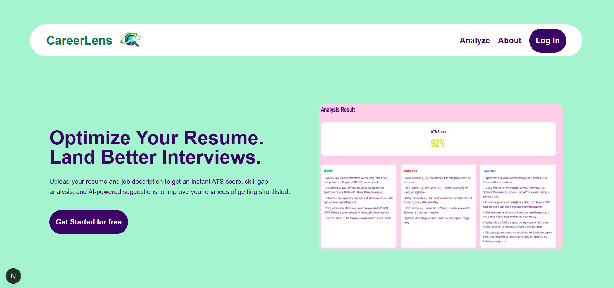
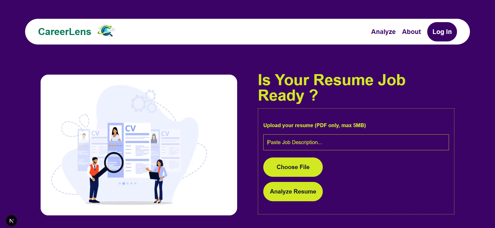

# <p align="center">
  
  <span style="font-size:34px;font-weight:700;">CareerLens</span>
  <p align="center">AI Resume Analyzer</p>
</p>


<p> 

<span>CareerLens – AI Resume Analyzer</span>
</p>
CareerLens is a full-stack AI-powered resume analysis platform that helps job seekers evaluate how well their resume matches a job description and receive actionable improvement suggestions. It simulates ATS-style matching and provides insights to improve resume quality and hiring chances.

---

## 🔗 Live Links

Frontend (Vercel): https://career-lens-fawn.vercel.app/

Backend API (Render): https://ai-resume-analyzer-kt78.onrender.com/docs

---

## ✨ What this project does

CareerLens helps job seekers understand how well their resume matches a specific job description by leveraging AI-powered analysis. Users can upload their resume, paste a job description, and instantly receive structured feedback to improve their chances of passing Applicant Tracking Systems (ATS) and attracting recruiters.

The platform provides:

- An ATS compatibility score based on resume–job alignment
- Identification of resume strengths
- Detection of missing or required skills
- Personalized improvement suggestions
- Secure authentication using Google Sign-In
- A dedicated results page with clean visualization

CareerLens simplifies the resume optimization process into a fast, intuitive workflow, allowing candidates to make data-driven improvements before applying.

---

## 🚀 Features

### 🔐 Authentication

Google Sign-In using NextAuth
Secure session handling
Protected routes for analysis & results

### 📄 Resume Analysis

- Upload resume (PDF only)
- Paste job description
- AI-powered resume parsing
- ATS compatibility score
- Strengths identification
- Missing skills detection
- Personalized improvement suggestions

### 📊 Results Page

- Dedicated result route
- ATS score display
- Strengths / Missing Skills / Suggestions cards
- Temporary result persistence using localStorage
- Auto-clear after viewing

### 🎨 UI / UX

- Modern responsive UI with Tailwind CSS
- Clean navigation with sticky navbar
- About, Features & FAQ sections
- Footer with project links

### 🌐 Deployment

- Frontend deployed on Vercel
- Backend deployed on Render

---

## 🧠 How It Works

1. User logs in with Google
2. Uploads resume (PDF)
3. Pastes job description
4. Backend extracts resume text
5. AI compares resume with job description
6. Generates:
   - ATS Score
   - Strengths
   - Missing Skills
   - Resume Improvement Suggestions
 7. User is redirected to a dedicated Result page

---

## 🛠 Tech Stack

### Frontend

- Next.js (App Router)
- React
- Tailwind CSS
- NextAuth

### Backend

- FastAPI
- Python
- Gemini AI
- PDFPlumber

### Auth

- NextAuth.js
- Google OAuth

### Deployment

- Frontend: Vercel
- Backend: Render

---

## 📂 Project Structure
```md
frontend/
 ├── src/app
 │   ├── page.jsx
 │   ├── about/
 │   ├── result/
 │   └── api/auth
 ├── src/components
 │   ├── UploadForm.jsx
 │   ├── Navbar.jsx
 │   ├── Footer.jsx
 │   └── ClientLayout.jsx

backend/
 ├── main.py
 ├── services/
 ├── utils/
```

---

## ▶ How to run locally

### Clone the repo and move inside folder:
```bash
git clone https://github.com/Himanshimittal051104/CareerLens.git
cd CareerLens
```

### Start Backend

Go to backend folder:
```bash
cd backend
```

Install dependencies:
```bash
pip install -r requirements.txt
```

Start backend server:
```bash
uvicorn main:app --reload
```

Backend will run at:
```text
http://127.0.0.1:8000
```

Create .env.local:
```text
GEMINI_API_KEY=your_api_key
```

### Start Frontend

Go to frontend folder:
```bash
cd frontend
```
Install packages:
```bash
npm install
```

Start frontend:
```bash
npm run dev
```

Open in browser:
```text
http://localhost:3000
```

Create .env.local:
```text
NEXT_PUBLIC_API_URL=http://localhost:8000
NEXTAUTH_SECRET=your_secret
NEXTAUTH_URL=http://localhost:3000
GOOGLE_CLIENT_ID=your_id
GOOGLE_CLIENT_SECRET=your_secret
```

---

## 📸 Screenshots





---

## 📌 Why CareerLens?

Job applications are competitive and ATS systems filter most resumes before a human sees them.

CareerLens helps candidates:

- Understand resume-job alignment
- Identify skill gaps
- Improve resume quality
- Increase interview chances
- All in one simple workflow.

---

## 🔮 Future Improvements

- Resume preview
- Downloadable PDF report
- Resume history per user
- Comparison between multiple resumes
- Dashboard analytics

---

## 👩‍💻 Author

Himanshi Mittal

---

## ⭐ Support

If you found this project helpful, consider giving it a star ⭐

---
